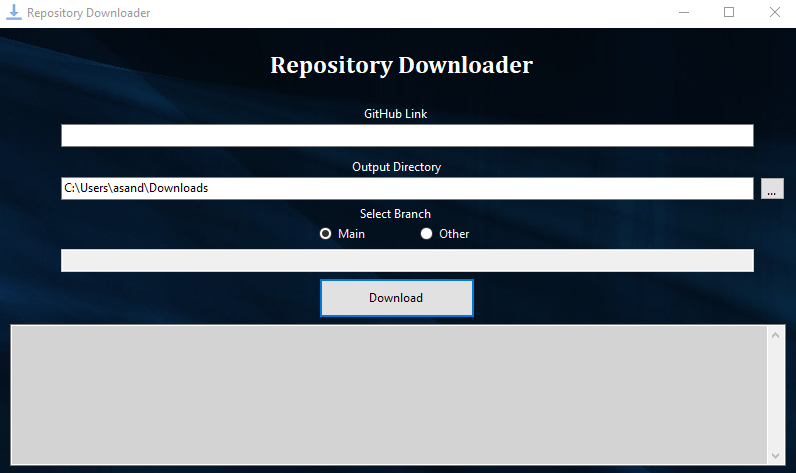

# GitHub Repository Downloader

A simple .NET Core application that allows you to download repositories from GitHub. This application is useful for downloading repositories that are not available as a zip file and cuts out having to navigate to the GitHub website to download a repository.

## Features

- Download a repository from GitHub with a single command.
- Specify a custom download location.
- Select a branch to download.

## Prerequisites

- .NET 6.0 SDK or later.
- Git.

## Limitations

- The application only supports downloading public repositories.
- The application does not support downloading repositories with private submodules.

## Usage

Simply enter the GitHub link to the repository you wish to download as the first argument to the application. The application will download the repository to the current working directory which is by default the 'Downloads' folder. If you do not have a 'Downloads' folder, the application will select the Desktop as the download location. You can also specify a custom download location by clicking the '...' button and then select the desired location. After you have selected the download location, click the 'Download' button to begin the download. If you have a specific branch you need yo select, you can specify it by entering the branch name in the 'Branch' text box. If you do not specify a branch, the application will download the default branch of the repository.

## Screenshots

Initial screen of the application.   

## Contributions

Contributions are welcome! If you have any issues or feature requests, please open an issue!

## Contributors

- [Alex Sanderson](github.com/Vexelior)