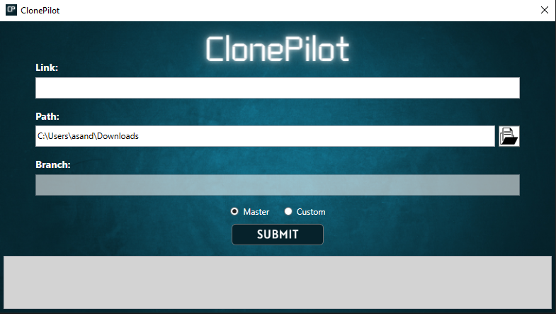

# ClonePilot

A .NET application that allows you to clone repositories from GitHub. This application is useful for cloneing repositories that are not available as a zip file and cuts out having to navigate to the GitHub website to clone a repository.

## Features

- Clone a repository from GitHub with a single command.
- Specify a custom clone location.
- Select a branch to clone.

## Prerequisites

- .NET 8 SDK
- Git

## Limitations

- The application only supports cloneing public repositories.
- The application does not support cloneing repositories with private submodules.

## Usage

Simply enter the GitHub link to the repository. The application will clone the repository to the current working directory which is by default the 'Downloads' folder. If you do not have this folder, the application will leave this field empty for user population. You can also specify a custom location by clicking the folder button and then select the desired location. 
If you have a specific branch you need yo select, you can specify it by entering the branch name in the 'Branch' text box. If you do not specify a branch, the application will clone the default master/main branch of the repository.

After you have specified all of your settings, click the 'Submit' button to begin the clone. 

## Screenshots

Initial screen of the application.   

## Contributions

Contributions are welcome! If you have any issues or feature requests, please open an issue!

## Contributors

- [Alex Sanderson](github.com/Vexelior)
